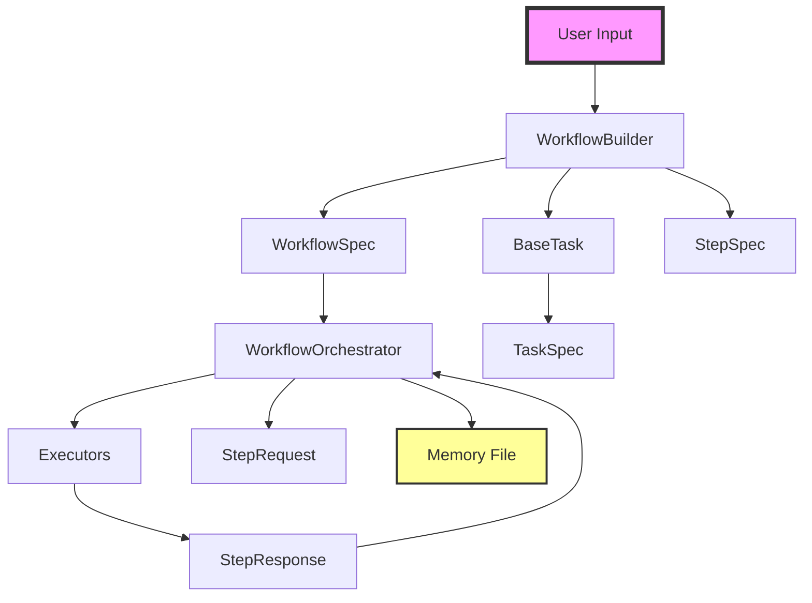

# High-Level Architecture Diagram

## Component Overview

- **WorkflowBuilder**: Fluent API for building workflow specifications
- **WorkflowSpec**: Immutable specification containing goal, tasks, and steps
- **WorkflowOrchestrator**: Executes steps in order using registered executors
- **Executors**: Implement step execution (LLM, Shell, Python)
- **BaseTask/TaskSpec**: Reusable task definitions and documents
- **StepSpec**: Individual executable units with configuration
- **Memory File**: Persistent memory across workflow executions

## Key Relationships

- Builder produces immutable Specs
- Orchestrator consumes Specs and produces execution Requests/Responses
- Steps reference Tasks for documentation and context
- Memory persists between executions for continuity
