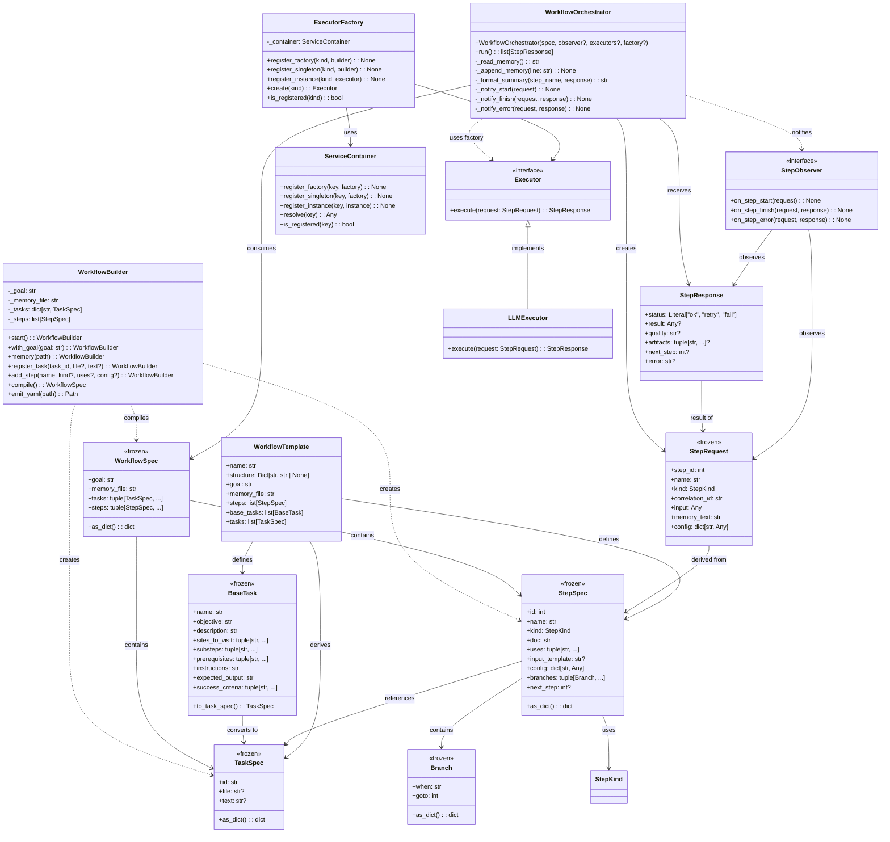

# Low-Level Class Diagram

## Key Data Flows

1. **Build Phase**: WorkflowBuilder → TaskSpec/StepSpec → WorkflowSpec
2. **Execution Phase**: WorkflowSpec → WorkflowOrchestrator → StepRequest → Executor → StepResponse
3. **Memory**: Orchestrator reads/writes persistent memory file
4. **Templates**: WorkflowTemplate provides defaults for WorkflowBuilder

## Design Patterns

- **Builder Pattern**: Incremental building of complex objects
- **Factory Pattern**: Creation of executors via dependency injection
- **Observer Pattern**: Notification system for step lifecycle events
- **Template Method**: WorkflowTemplate providing reusable structures
